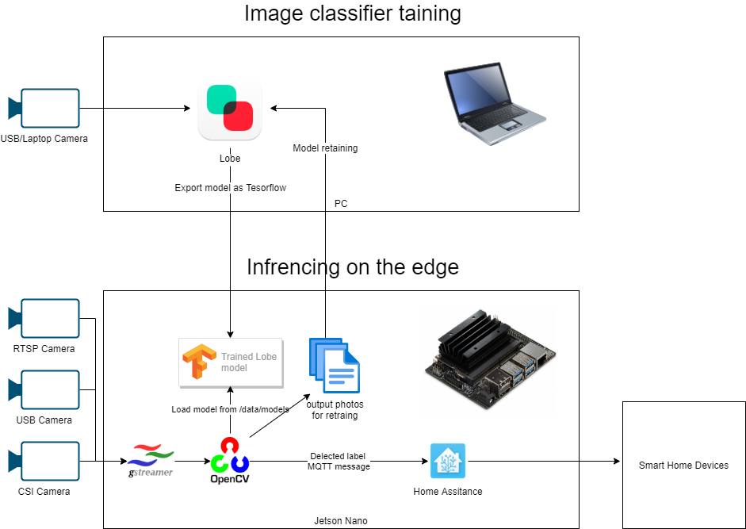
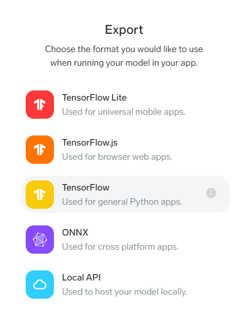

# Binha
The goal of this project is demonstrating AI capabilities to Smart Home platform like Home Assistance and have a base ground for contribution.

Our Binha starter kit project is comprised of several components both hardware and software, we chose to cooporate with Nvidia and deploy all software on Nvidia Jetson Nano which is a small factor edge device with GPU which capable of accelerating deeplearning models infrencing and training.

# Architecure



We chose to use Microsoft Lobe for image cassification as its very easy to use and free of charge.

Video analytics framework which was used is comprised of gstreamer and OpenCV as it is already preinstalled on the Nvidia Jetson base image and very easy to use.

There are more advanced video analytics framework like [Microsoft Live Video Analytics (LVA)](https://azure.microsoft.com/en-us/services/media-services/live-video-analytics/) and [Nvidia Deepstream SDK](https://developer.nvidia.com/deepstream-SDK), we are considering to add support for those in the future.

The device can be also managed remotely as an IoT Edge device and all components can be deployed as docker containers using [Azure IoT Edge](https://docs.microsoft.com/en-us/azure/iot-edge/about-iot-edge) but to make this solution simple and easy to learn we have decided to reduce the technology stack.

# Prerequisites 
This project assumes you are starting Wifi-connected headless Jetson Nanon device and a USB camera, we provide a BOM list and full instructions where to order the parts from and how to assemble it.

## Bill of Materials
* Jetson Nano
* Intel WiFi
* Fan
* TODO- complete all BOM with links to purchase from
* for initial setup - an HDMI cable, keyboard, mouse and PC

## Software
* [Lobe](https://lobe.ai/) 
* Remote Desktop Connection and SSH file transfer, we used [MobaXterm](https://mobaxterm.mobatek.net/download.html), they have a free version capable for both

# Setup
## Step 1 - Assemble hardware kit
TODO: add step by step instructions with photos

## Step 2 - Getting Started with Jetson Nano Developer Kit
follow [Nvidia Jetson nano devkit instructions](https://developer.nvidia.com/embedded/learn/get-started-jetson-nano-devkit) for preparing base image microSD card and initial setup.

compelete Ubuntu setup and connect to your home WiFi, write down your local IP address so you could connect by SSH and finish the software setup remotely from your PC.

## Step 3 - Install Microsft Lobe on your PC
* [Download](https://lobe.ai/) and install Micosoft Lobe.
* Watch [Lobe's Tour](https://youtu.be/Mdcw3Sb98DA) to have the basic idea how to operate it and a train Computer Vision image cassifier

## Step 4 - Software install on your Jetson Device
SSH into your Jetson device remotely from your PC, we used [MobaXterm](https://mobaxterm.mobatek.net/download.html), during installation you'll need to reboot. 

 Jetson nano image is already preinstalled with OpenCV, the only requierment which needed to get install is Tensoflow version 1.15.3 in order to run Lobe exported TF model, this process can take ~40min

### install Tensorflow (library used by lobe for neural network based image calssifier model)

the following commands are based on the a guide by Nvidia (incase it get changed in the future) https://docs.nvidia.com/deeplearning/frameworks/install-tf-jetson-platform/index.html

```bash
sudo apt-get update
sudo apt upgrade
sudo apt-get install libhdf5-serial-dev hdf5-tools libhdf5-dev zlib1g-dev zip libjpeg8-dev liblapack-dev libblas-dev gfortran
sudo apt-get install python3-pip
pip3 install -U pip testresources setuptools==49.6.0
pip3 install -U numpy==1.16.1 future==0.18.2 mock==3.0.5 h5py==2.10.0 keras_preprocessing==1.1.1 keras_applications==1.0.8 gast==0.2.2 futures protobuf pybind11
sudo pip3 install --pre --extra-index-url https://developer.download.nvidia.com/compute/redist/jp/v44 'tensorflow==1.15.3'
sudo reboot
```

### Install Docker compose
1. Install cURL:
   ```
   sudo apt update
   sudo apt upgrade
   sudo apt install curl
   ```
2. Download `docker-compose`:
   ```
   sudo curl -L --fail https://raw.githubusercontent.com/linuxserver/docker-docker-compose/master/run.sh -o /usr/local/bin/docker-compose
   ```
3. Set it with execute permissions:
   ```
   sudo chmod +x /usr/local/bin/docker-compose
   ```
4. Verify it's installed property:
   ```
   sudo /usr/local/bin/docker-compose --version
   ```
   It should first install the image, then you should get something like:
   ```
   docker-compose version 1.28.0, build d02a7b1a
   ```
   
   See original thread [here](https://github.com/docker/compose/issues/6831)

### Clone this repository and install python dependancies 
```bash
cd ~
mkdir repos
cd repos
git clone https://github.com/guybartal/Binha.git
cd Binha
sudo pip3 install -r requirements.txt
# create a folder which will hold all our image classifiers
mkdir /data/models
# create a folder which will hold output of classified images by the baked model so we could retrain and improve our model
mkdir /data/output
```

### Install Home Assistant and MQTT broker
Go to [ha/README.md](ha/README.md)

### Train your own image classifier with Lobe

You can train your own image classifier and export it as Tensorflow format or use our [pre-trained models](https://binha.blob.core.windows.net/models/hands-tf.zip).



upload your expored lobe tf model folder into /data/models inside your jetson device.
after running the classifer should start inference on your csi camera feed and store a frame in the output folder per 30 frames with the predicted label so you could test and retrain your model.

### Run video classifier on CSI camera - TODO: change to deamon/docker

SSH into your jetson device and run the following command (change the path to match your trained model path)
```bash
python3 classifier.py --model_dir /data/models/hands --output_dir /data/output
```

### Run video classifier on RTSP camera - TODO: change to deamon/docker

SSH into your jetson device and run the following command (change the path to match your trained model path)
```bash
python3 classifier-rtsp.py --model_dir /data/models/hands --output_dir /data/output
```


### dockerized version (Alternative option - TODO - check if it works with GPU)
incase you want to run the classifier inside docker, use this command:

```
docker run -it --name lobe --net=host --runtime nvidia  -e DISPLAY=$DISPLAY -w /opt/nvidia/deepstream/deepstream-5.0   -v /tmp/argus_socket:/tmp/argus_socket -v /usr/lib/aarch64-linux-gnu:/usr/lib/aarch64-linux-gnu -v /usr/lib/python3.6/dist-packages/cv2:/usr/lib/python3.6/dist-packages/cv2 -v /home/nvidia/ds_workspace:/home/mounted_workspace -v /data/models:/data/models  --device /dev/video0:/dev/video0 -v /tmp/.X11-unix/:/tmp/.X11-unix guybartal/smarthomelobe:v0.3 /bin/bash

cd /app
python3 classifier.py --model_dir /data/models/replace_with_your_model_dir --output_dir /data/output
```

## Get involved

We really appreciate any feedback related to Binha, and also just enjoy seeing what you're working on!  There is a growing community of Binha and Binha users.  It's easy to get involved involved...

* Ask a question and discuss Binha related topics or share your project on the [Binha GitHub Discussions](https://github.com/Microsoft/Binha/discussions)
* Report a bug by [creating an issue](https://github.com/Microsoft/Binha/issues)
